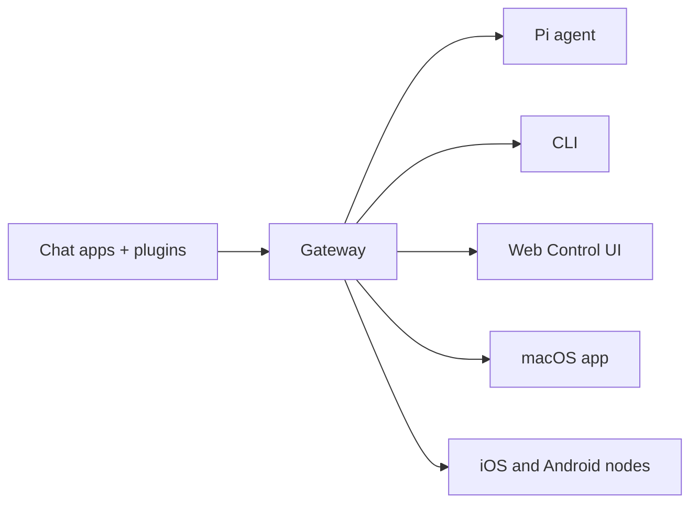

# OpenClaw Complete Technical Guide

> **OpenClaw 🦞** - Self-hosted gateway connecting AI agents across Discord, Google Chat, iMessage, Matrix, Microsoft Teams, Signal, Slack, Telegram, WhatsApp, Zalo, and more.

**Version:** 2026.4.15  
**Last Updated:** April 22, 2026  
**Official Documentation:** https://docs.openclaw.ai

---

## Table of Contents

1. [Introduction & Overview](#1-introduction--overview)
2. [Installation & Setup](#2-installation--setup)
3. [Gateway](#3-gateway)
4. [Channels](#4-channels)
5. [Agent Runtime](#5-agent-runtime)
6. [Automation](#6-automation)
7. [Tools & Skills](#7-tools--skills)
8. [Advanced Features](#8-advanced-features)
9. [CLI Reference](#9-cli-reference)
10. [Model Providers](#10-model-providers)
11. [Troubleshooting](#11-troubleshooting)
12. [Reference](#12-reference)

---

## 1. Introduction & Overview

### What is OpenClaw?

OpenClaw is a **self-hosted gateway** that connects your favorite chat apps and messaging platforms to AI coding agents. You run a single Gateway process on your own machine (or a server), and it becomes the bridge between your messaging apps and an always-available AI assistant.

**Key Points:**

- **Self-hosted**: Runs on your hardware, your rules
- **Multi-channel**: One Gateway serves multiple chat platforms simultaneously
- **Agent-native**: Built for coding agents with tool use, sessions, memory, and multi-agent routing
- **Open source**: MIT licensed, community-driven

### Architecture Overview



**Components:**

- **Gateway (daemon)**: Long-lived process that maintains provider connections and exposes a typed WebSocket API
- **Clients**: macOS app, CLI, web admin connecting via WebSocket
- **Nodes**: macOS/iOS/Android/headless devices with `role: node` providing device capabilities
- **WebChat**: Static UI using the Gateway WS API for chat history and messaging

The Gateway is the single source of truth for sessions, routing, and channel connections.

### Key Capabilities

| Feature | Description |
|---------|-------------|
| **Multi-channel gateway** | Discord, iMessage, Signal, Slack, Telegram, WhatsApp, WebChat, and more with a single Gateway process |
| **Plugin channels** | Bundled plugins add Matrix, Nostr, Twitch, Zalo, and more |
| **Multi-agent routing** | Isolated sessions per agent, workspace, or sender |
| **Media support** | Send and receive images, audio, and documents |
| **Web Control UI** | Browser dashboard for chat, config, sessions, and nodes |
| **Mobile nodes** | Pair iOS and Android nodes for Canvas, camera, and voice-enabled workflows |

### Use Cases

- **Personal AI assistant**: Message your AI from any chat app
- **Development workflows**: Code review, debugging, and task automation
- **Home automation**: Control smart devices via chat
- **Multi-platform integration**: Unified interface across messaging platforms
- **Privacy-focused AI**: Keep your data on your own infrastructure

---

## 2. Installation & Setup

### Requirements

| Requirement | Details |
|-------------|---------|
| **Node.js** | Node 24 (recommended) or Node 22.14+ (LTS) |
| **Operating System** | macOS, Linux, or Windows (native or WSL2) |
| **API Keys** | From your chosen provider (Anthropic, OpenAI, Google, etc.) |
| **Package Manager** | npm (bundled), pnpm, or bun (optional) |

### Quick Installation

#### Recommended: Installer Script

**macOS / Linux / WSL2:**
```bash
curl -fsSL https://openclaw.ai/install.sh | bash
```

**Windows (PowerShell):**
```powershell
iwr -useb https://openclaw.ai/install.ps1 | iex
```

**Without onboarding:**
```bash
# macOS / Linux / WSL2
curl -fsSL https://openclaw.ai/install.sh | bash -s -- --no-onboard

# Windows
& ([scriptblock]::Create((iwr -useb https://openclaw.ai/install.ps1))) -NoOnboard
```

#### Alternative: npm/pnpm/bun

**npm:**
```bash
npm install -g openclaw@latest
openclaw onboard --install-daemon
```

**pnpm:**
```bash
pnpm add -g openclaw@latest
pnpm approve-builds -g  # Required for build scripts
openclaw onboard --install-daemon
```

**bun:**
```bash
bun add -g openclaw@latest
openclaw onboard --install-daemon
```

#### From Source

```bash
git clone https://github.com/openclaw/openclaw.git
cd openclaw
pnpm install && pnpm build && pnpm ui:build
pnpm link --global
openclaw onboard --install-daemon
```

### Onboarding Wizard

The onboarding wizard guides you through initial setup:

```bash
openclaw onboard --install-daemon
```

**Steps:**

1. **Profile selection**: Local or remote mode
2. **API key configuration**: Set up your chosen AI provider
3. **Channel selection**: Choose and configure messaging platforms
4. **Agent workspace**: Initialize workspace files
5. **Service installation**: Set up auto-start (launchd/systemd/schtasks)

**Options:**

| Flag | Description |
|------|-------------|
| `--install-daemon` | Install and start the Gateway service |
| `--mode local` | Configure for local-only access |
| `--mode remote` | Configure for remote access |
| `--auth-choice <provider>` | Skip provider selection (e.g., `openai-api-key`, `anthropic`) |
| `--skip-channels` | Skip channel configuration |

### Configuration Basics

Configuration lives at `~/.openclaw/openclaw.json` (JSON5 format).

**Minimal configuration:**
```json5
{
  gateway: {
    mode: "local",
    bind: "loopback",
    port: 18789,
  },
  agents: {
    defaults: {
      workspace: "~/.openclaw/workspace",
      model: { primary: "anthropic/claude-opus-4-6" },
    },
  },
  channels: {
    whatsapp: {
      allowFrom: ["+15555550123"],
    },
  },
}
```

**Key configuration paths:**

| Path | Description |
|------|-------------|
| `~/.openclaw/openclaw.json` | Main configuration file |
| `~/.openclaw/workspace/` | Agent workspace (code, files, memory) |
| `~/.openclaw/state/` | Runtime state (sessions, pairing, approvals) |
| `~/.openclaw/agents/` | Agent sessions and logs |

### Verify Installation

```bash
openclaw --version      # Confirm CLI is available
openclaw doctor         # Check for config issues
openclaw gateway status # Verify Gateway is running
```

**Healthy output:**
- `Runtime: running`
- `Connectivity probe: ok`
- `Capability: ...` (matches expected permissions)

---

## 3. Gateway

### Gateway Architecture

The Gateway is the central hub that:

- Maintains connections to all messaging platforms
- Exposes a WebSocket API on a single port (default: 18789)
- Routes messages between channels and agents
- Handles authentication and pairing
- Serves the Control UI and HTTP APIs

**Default runtime model:**

- One always-on process for routing and control plane
- Single multiplexed port for WebSocket, HTTP APIs, Control UI, and hooks
- Default bind mode: `loopback` (127.0.0.1)
- Auth required by default (token, password, or trusted-proxy)

### Configuration Reference

**Gateway configuration keys:**

| Key | Type | Default | Description |
|-----|------|---------|-------------|
| `gateway.mode` | `"local"` \| `"remote"` | `"local"` | Gateway mode (must be set) |
| `gateway.bind` | `"loopback"` \| `"lan"` \| `"tailnet"` \| `"auto"` \| `"custom"` | `"loopback"` | Bind mode |
| `gateway.port` | number | `18789` | WebSocket/HTTP port |
| `gateway.auth.mode` | `"token"` \| `"password"` \| `"trusted-proxy"` \| `"none"` | `"token"` | Auth mode |
| `gateway.auth.token` | string \| SecretRef | - | Shared token for auth |
| `gateway.auth.password` | string \| SecretRef | - | Password for auth |
| `gateway.reload.mode` | `"off"` \| `"hot"` \| `"restart"` \| `"hybrid"` | `"hybrid"` | Config reload behavior |

**Environment variables:**

| Variable | Description |
|----------|-------------|
| `OPENCLAW_GATEWAY_TOKEN` | Override gateway auth token |
| `OPENCLAW_GATEWAY_PASSWORD` | Override gateway auth password |
| `OPENCLAW_GATEWAY_PORT` | Override gateway port |
| `OPENCLAW_CONFIG_PATH` | Override config file path |
| `OPENCLAW_STATE_DIR` | Override state directory |

### Remote Access

**Recommended: Tailscale/VPN**

1. Install Tailscale on both machines
2. Configure Gateway for tailnet bind:
   ```bash
   openclaw config set gateway.bind tailnet
   openclaw config set gateway.tailscale.mode serve
   ```
3. Access from any device on your tailnet

**Alternative: SSH Tunnel**

On the client machine:
```bash
ssh -N -L 18789:127.0.0.1:18789 user@gateway-host
```

Then connect clients to `ws://127.0.0.1:18789`.

**Warning:** SSH tunnels do not bypass gateway auth. Clients must still send valid credentials.

### Security and Authentication

**Auth modes:**

| Mode | Use Case | Credentials |
|------|----------|-------------|
| `token` | Shared secret token | `gateway.auth.token` or `OPENCLAW_GATEWAY_TOKEN` |
| `password` | Shared password | `gateway.auth.password` or `OPENCLAW_GATEWAY_PASSWORD` |
| `trusted-proxy` | Reverse proxy with identity headers | Headers like `X-Forwarded-User` |
| `none` | Private network only (dangerous) | No auth required |

**Device pairing:**

- All WebSocket clients include a device identity on connect
- New device IDs require pairing approval
- Gateway issues a device token for subsequent connects
- Direct local loopback connects can be auto-approved
- Remote connects always require explicit approval

**Managing devices:**
```bash
openclaw devices list               # Show pending/approved devices
openclaw devices approve <requestId>  # Approve pending device
openclaw devices reject <requestId>   # Reject pending device
openclaw devices revoke <deviceId>    # Revoke approved device
```

### Health Checks and Troubleshooting

**Command ladder:**
```bash
openclaw status                  # Quick status check
openclaw gateway status          # Detailed gateway status
openclaw gateway status --deep   # Include system service scan
openclaw logs --follow           # Watch live logs
openclaw doctor                  # Run diagnostics
openclaw channels status --probe # Check channel health
```

**Common issues:**

| Issue | Symptoms | Fix |
|-------|----------|-----|
| Port conflict | `EADDRINUSE` | Change port or kill conflicting process with `--force` |
| Auth mismatch | `unauthorized` | Verify token/password matches on client and gateway |
| Service not starting | `Runtime: stopped` | Check logs, run `openclaw doctor` |
| Mode not set | `Gateway start blocked` | Set `gateway.mode="local"` in config |

**Health check endpoints:**

- **Liveness**: Open WS and send `connect`, expect `hello-ok`
- **Readiness**: `openclaw gateway status` + `openclaw channels status --probe`

---

## 4. Channels

### Multi-Channel Support

OpenClaw supports simultaneous connections to multiple messaging platforms:

**Built-in channels:**
- WhatsApp (via Baileys)
- Telegram (via grammY)
- Discord
- Signal
- Slack
- WebChat

**Plugin channels (bundled):**
- Matrix
- Microsoft Teams
- Google Chat
- iMessage (via BlueBubbles)
- IRC
- Nostr
- Twitch
- Zalo
- And more...

### Channel-Specific Setup

#### WhatsApp

**Setup:**
```bash
openclaw channels login --channel whatsapp
```

Scan the QR code with your phone (Settings → Linked Devices → Link a Device).

**Configuration:**
```json5
{
  channels: {
    whatsapp: {
      allowFrom: ["+15555550123"],  // Whitelist specific numbers
      groups: {
        "*": { requireMention: true },  // Require @mention in all groups
      },
    },
  },
  messages: {
    groupChat: {
      mentionPatterns: ["@openclaw", "@bambabot"],
    },
  },
}
```

**Troubleshooting:**
- QR code not appearing: Check logs with `openclaw logs --follow`
- Connection lost: Restart with `openclaw channels login --channel whatsapp`
- Session expired: Delete `~/.openclaw/state/channels/whatsapp/` and re-pair

#### Telegram

**Setup:**
1. Create a bot via [@BotFather](https://t.me/BotFather)
2. Get the bot token
3. Configure:
   ```bash
   openclaw channels add --channel telegram --token <YOUR_BOT_TOKEN>
   ```

**Configuration:**
```json5
{
  channels: {
    telegram: {
      token: "<YOUR_BOT_TOKEN>",
      allowFrom: [556056149],  // User IDs (numeric)
      groups: {
        "*": { requireMention: true },
      },
    },
  },
}
```

#### Discord

**Setup:**
1. Create a Discord app at [Discord Developer Portal](https://discord.com/developers/applications)
2. Add a bot and get the token
3. Configure:
   ```bash
   openclaw channels add --channel discord --token <YOUR_BOT_TOKEN>
   ```

**Required bot permissions:**
- Read Messages
- Send Messages
- Read Message History
- Add Reactions

**Configuration:**
```json5
{
  channels: {
    discord: {
      token: "<YOUR_BOT_TOKEN>",
      intents: ["guilds", "guildMessages", "directMessages", "messageContent"],
      guilds: {
        "<GUILD_ID>": { requireMention: true },
      },
    },
  },
}
```

#### Signal

**Setup:**
1. Install signal-cli:
   ```bash
   # macOS
   brew install signal-cli
   
   # Linux
   apt install signal-cli
   ```

2. Link device:
   ```bash
   signal-cli link -n "OpenClaw"
   ```

3. Configure OpenClaw (auto-detected if signal-cli is available)

### Group Messages and Routing

**Mention patterns:**
```json5
{
  messages: {
    groupChat: {
      mentionPatterns: [
        "@openclaw",
        "@bot",
        "hey openclaw",
      ],
      requireMention: true,  // Global default
    },
  },
}
```

**Per-channel group rules:**
```json5
{
  channels: {
    whatsapp: {
      groups: {
        "*": { requireMention: true },           // All groups
        "<GROUP_JID>": { requireMention: false }, // Specific group
      },
    },
    telegram: {
      groups: {
        "*": { requireMention: true },
        "-1001234567890": { requireMention: false },
      },
    },
  },
}
```

### Pairing and Security

**Pairing modes:**

| Mode | Description | Use Case |
|------|-------------|----------|
| `pairing` | Require approval for new DMs | Personal assistant (default) |
| `allowlist` | Only listed users/numbers | Strict security |
| `open` | Accept all DMs | Public bot |
| `disabled` | Reject all DMs | Group-only bot |

**Managing pairing:**
```bash
openclaw pairing list --channel whatsapp
openclaw pairing approve --channel whatsapp --sender +15555550123
openclaw pairing reject --channel whatsapp --sender +15555550123
openclaw pairing remove --channel whatsapp --sender +15555550123
```

**Allowlists:**
```json5
{
  channels: {
    whatsapp: {
      allowFrom: ["+15555550123", "+15555550456"],
      groups: {
        allowFrom: ["<GROUP_JID_1>", "<GROUP_JID_2>"],
      },
    },
  },
}
```

---

## 5. Agent Runtime

### Agent Workspace

The agent workspace is the single working directory for all agent operations.

**Location:** `~/.openclaw/workspace` (configurable via `agents.defaults.workspace`)

**Workspace structure:**
```
~/.openclaw/workspace/
├── AGENTS.md          # Operating instructions + memory
├── SOUL.md            # Persona, boundaries, tone
├── TOOLS.md           # User-maintained tool notes
├── IDENTITY.md        # Agent name/vibe/emoji
├── USER.md            # User profile
├── BOOTSTRAP.md       # First-run ritual (auto-deleted)
├── memory/            # Daily logs (YYYY-MM-DD.md)
│   ├── 2026-04-22.md
│   └── ...
├── skills/            # User skills (highest priority)
├── .agents/skills/    # Project skills
└── ...                # User files and projects
```

**Bootstrap files (injected on first turn):**

These files are automatically loaded into the agent's context at the start of each session:

| File | Purpose | Required |
|------|---------|----------|
| `AGENTS.md` | Operating instructions, conventions, "memory" | Yes |
| `SOUL.md` | Personality, boundaries, tone | Yes |
| `TOOLS.md` | Tool notes (camera names, SSH hosts, etc.) | Optional |
| `IDENTITY.md` | Agent name, emoji, avatar | Optional |
| `USER.md` | User profile and preferences | Optional |
| `BOOTSTRAP.md` | One-time first-run ritual | Optional (auto-deleted) |

**Initialize workspace:**
```bash
openclaw setup  # Creates config and workspace if missing
```

### Session Management

**Session storage:**
- `~/.openclaw/agents/<agentId>/sessions/<SessionId>.jsonl`

**Session scoping:**

| Scope | Description | Use Case |
|-------|-------------|----------|
| Per-sender | One session per chat contact | Default, maintains context per user |
| Per-channel | One session per channel/group | Shared context in group chats |
| Per-agent | Single global session | Unified memory across all chats |
| Per-workspace | Isolated by workspace path | Development/testing |

**Session commands:**
```bash
openclaw sessions list               # List active sessions
openclaw sessions inspect <id>       # Show session details
openclaw sessions prune --older-than 30d  # Clean old sessions
openclaw sessions reset <id>         # Reset session (clear history)
```

### Multi-Agent Routing

Run multiple agents with isolated contexts:

**Configuration:**
```json5
{
  agents: {
    defaults: {
      model: { primary: "anthropic/claude-opus-4-6" },
      workspace: "~/.openclaw/workspace",
    },
    list: [
      {
        id: "main",
        model: { primary: "anthropic/claude-opus-4-6" },
        workspace: "~/.openclaw/workspace",
      },
      {
        id: "coding",
        model: { primary: "openai/gpt-5.4" },
        workspace: "~/.openclaw/workspace/coding",
      },
    ],
  },
}
```

**Route to specific agent:**
```bash
openclaw agent --agent coding --message "Review this PR"
```

**In chat:**
```
/agent coding review this PR
```

### Memory (MEMORY.md, Daily Logs)

**Daily logs:**
- Created automatically at `memory/YYYY-MM-DD.md`
- Raw capture of events, decisions, and interactions
- Not auto-loaded (read explicitly when needed)

**MEMORY.md:**
- Curated long-term memory
- Loaded in main sessions only (not shared contexts)
- Updated periodically by reviewing daily logs
- Contains: decisions, lessons learned, preferences, project notes

**Example MEMORY.md structure:**
```markdown
# MEMORY.md

## Decisions
- 2026-04-15: Switched to Claude Opus for main assistant (better reasoning)
- 2026-04-10: YouTube auto-triage sends summary at 20:30

## Lessons Learned
- Always use `trash` instead of `rm` for recoverable deletes
- Group chats: respond only when mentioned or adding value

## Preferences
- Voice: Use ElevenLabs TTS for stories and long-form content
- Code: Prefer detailed comments and type hints

## Projects
### YouTube Chen
- Location: ~/.openclaw/workspace/youtube_chen/
- Status: Active
- Purpose: Auto-process YouTube videos, generate technical docs
```

**Memory search:**
```bash
openclaw memory search "youtube processing"
openclaw memory get MEMORY.md --lines 50
```

### Context Engine

The context engine manages what gets included in each agent turn:

**Context priority (highest to lowest):**

1. **Current message**: User's latest input
2. **Bootstrap files**: AGENTS.md, SOUL.md, etc. (first turn only)
3. **Session history**: Recent conversation turns
4. **Tool results**: Output from previous tool calls
5. **Memory**: Explicit memory retrieval (when triggered)
6. **Workspace files**: Files read during the session

**Context budget:**
- Models have context windows (e.g., Claude Opus: 200k tokens)
- OpenClaw trims old history when context is full
- Important: Bootstrap files and recent turns always included

**Compaction:**
When context exceeds limits, older messages are summarized or dropped.

---

## 6. Automation

### Cron Jobs

Schedule recurring or one-shot tasks.

**Create a scheduled task:**
```bash
# Recurring (cron expression)
openclaw cron add \
  --name "Daily Report" \
  --schedule "0 9 * * *" \
  --prompt "Generate a daily summary" \
  --deliver --target "+15555550123"

# One-shot (relative time)
openclaw cron add \
  --name "Reminder" \
  --at "+20m" \
  --prompt "Time for your meeting" \
  --deliver --target "+15555550123"

# One-shot (absolute time)
openclaw cron add \
  --name "Birthday Reminder" \
  --at "2026-05-01T09:00:00Z" \
  --prompt "Wish them happy birthday"
```

**Cron commands:**
```bash
openclaw cron list                 # List all jobs
openclaw cron status               # Scheduler status
openclaw cron runs --id <job>      # Show run history
openclaw cron remove --id <job>    # Delete a job
openclaw cron enable               # Enable scheduler
openclaw cron disable              # Disable scheduler
```

**Configuration:**
```json5
{
  cron: {
    enabled: true,
    jobs: [
      {
        id: "daily-report",
        name: "Daily Report",
        schedule: "0 9 * * *",
        prompt: "Generate daily summary",
        deliver: { channel: "telegram", target: "556056149" },
      },
    ],
  },
}
```

### TaskFlow

Orchestrate durable multi-step workflows.

**Use cases:**
- Multi-step research then summarize
- Async workflows with external dependencies
- Long-running background processing

**Example flow:**
```json5
{
  flows: {
    "inbox-triage": {
      steps: [
        { action: "classify", prompt: "Classify this email" },
        { action: "route", prompt: "Decide: urgent/normal/archive" },
        { action: "notify", prompt: "Send notification if urgent" },
      ],
    },
  },
}
```

**Flow commands:**
```bash
openclaw tasks flow list           # List active flows
openclaw tasks flow show <id>      # Show flow details
openclaw tasks flow cancel <id>    # Cancel a flow
```

### Hooks

Event-driven scripts triggered by lifecycle events.

**Hook types:**

| Event | Trigger | Use Case |
|-------|---------|----------|
| `session.new` | New session starts | Initialize workspace |
| `session.reset` | Session reset | Clean up state |
| `tool.exec` | Tool execution | Audit commands |
| `gateway.start` | Gateway starts | Health checks |
| `compaction` | Session compacted | Backup full history |

**Hook locations:**
- `~/.openclaw/hooks/`
- Workspace: `<workspace>/.openclaw/hooks/`

**Example hook** (`session.new.sh`):
```bash
#!/bin/bash
# Runs when a new session starts
echo "New session: $OPENCLAW_SESSION_ID"
echo "User: $OPENCLAW_USER_ID"
git pull  # Sync workspace
```

**Hook commands:**
```bash
openclaw hooks list                # List discovered hooks
openclaw hooks test session.new   # Test a hook
```

### Standing Orders

Persistent instructions injected into every session.

**Location:** Typically in `AGENTS.md`

**Example standing orders:**
```markdown
## Standing Orders

- Always check for updates before installing packages
- Never send emails without user confirmation
- Use `trash` instead of `rm` for file deletion
- In group chats, respond only when mentioned or adding clear value
- For code changes, explain reasoning before implementing
```

**Best practices:**
- Keep orders clear and actionable
- Combine with cron for time-based enforcement
- Document in AGENTS.md for transparency

---

## 7. Tools & Skills

### Built-in Tools

Core tools available to all agents:

| Tool | Purpose | Examples |
|------|---------|----------|
| `read` | Read file contents | `read path="README.md"` |
| `write` | Write files | `write path="output.txt" content="..."` |
| `edit` | Precise file edits | `edit path="app.js" oldText="..." newText="..."` |
| `exec` | Run shell commands | `exec command="ls -la"` |
| `process` | Manage background processes | `process action="poll" sessionId="..."` |
| `browser` | Control browser | `browser action="navigate" url="..."` |
| `canvas` | Present UI on nodes | `canvas action="present" url="..."` |
| `message` | Send messages | `message action="send" target="+1..." message="Hi"` |
| `memory_search` | Search memory | `memory_search query="project notes"` |
| `memory_get` | Read memory files | `memory_get path="MEMORY.md"` |

**Tool policy:**

Configure tool restrictions:

```json5
{
  tools: {
    exec: {
      security: "allowlist",  // "off" | "ask" | "allowlist" | "full"
      allowCommands: [
        "/usr/bin/git",
        "/usr/bin/npm",
      ],
    },
  },
}
```

### AgentSkills System

Skills extend agent capabilities with specialized workflows.

**Skill locations (priority order):**
1. Workspace: `<workspace>/skills`
2. Project: `<workspace>/.agents/skills`
3. Personal: `~/.agents/skills`
4. Managed: `~/.openclaw/skills`
5. Bundled: (shipped with OpenClaw)

**Skill structure:**
```
skill-name/
├── SKILL.md          # Skill documentation (required)
├── scripts/          # Executable scripts
├── references/       # Reference docs
└── ...
```

**Example SKILL.md:**
```markdown
# Skill: Weather

Get current weather via wttr.in.

## When to use
- User asks about weather, temperature, or forecasts

## How to use
```bash
curl wttr.in/london?format=j1
```

## Examples
- "What's the weather in London?"
- "Will it rain tomorrow in NYC?"
```

### Skill Discovery and Installation (ClawHub)

**ClawHub** is the skill registry for discovering and installing community skills.

**Commands:**
```bash
openclaw skills search weather       # Search ClawHub
openclaw skills install weather      # Install from ClawHub
openclaw skills update               # Update all installed skills
openclaw skills list                 # List installed skills
openclaw skills publish              # Publish to ClawHub
```

**Example:**
```bash
# Search for GitHub integration
openclaw skills search github

# Install GitHub skill
openclaw skills install github

# Update all skills
openclaw skills update
```

### Common Bundled Skills

| Skill | Description | Setup Required |
|-------|-------------|----------------|
| **1password** | 1Password CLI integration | `op` CLI + auth |
| **apple-notes** | Manage Apple Notes | macOS with Notes.app |
| **camsnap** | Capture from RTSP cameras | Camera URLs |
| **coding-agent** | Delegate to Codex/Claude Code | Codex/Claude CLI |
| **github** | GitHub operations via `gh` CLI | `gh` CLI + auth |
| **healthcheck** | Security audits and hardening | None |
| **openai-whisper** | Local speech-to-text | Whisper CLI |
| **sag** | ElevenLabs TTS | ElevenLabs API key |
| **weather** | Weather forecasts | None |
| **video-frames** | Extract video frames | ffmpeg |

**Setup example (1password):**
```bash
# Install 1Password CLI
brew install 1password-cli

# Sign in
op signin

# Enable desktop app integration
op integration enable "OpenClaw"

# Now the skill is ready
openclaw skills list  # Shows "✓ ready"
```

---

## 8. Advanced Features

### Nodes (iOS/Android)

Nodes are companion devices that extend agent capabilities.

**Node capabilities:**
- Canvas display and control
- Camera capture (photos/video)
- Screen recording
- Location services
- Device notifications
- SMS (Android)
- System commands (macOS/headless)

**Setup:**

1. **Install node app** (iOS/Android) or run headless:
   ```bash
   openclaw node run --host <gateway-host> --display-name "My Node"
   ```

2. **Pair the device:**
   ```bash
   openclaw devices list
   openclaw devices approve <requestId>
   ```

3. **Verify connection:**
   ```bash
   openclaw nodes status
   openclaw nodes describe --node <id-or-name>
   ```

**Node commands:**
```bash
# Camera
openclaw nodes camera snap --node <name>
openclaw nodes camera clip --node <name> --duration 10s

# Canvas
openclaw nodes canvas present --node <name> --target https://example.com
openclaw nodes canvas snapshot --node <name>

# Location
openclaw nodes location get --node <name>

# System (macOS/headless)
openclaw nodes notify --node <name> --title "Alert" --body "Message"
```

### Canvas and Browser Control

**Canvas:** Display web content on nodes (iOS/Android/macOS app).

**Browser control:** Automate browser interactions.

**Canvas commands:**
```bash
openclaw nodes canvas present --node <name> --target https://example.com
openclaw nodes canvas navigate https://google.com --node <name>
openclaw nodes canvas eval --node <name> --js "document.title"
openclaw nodes canvas snapshot --node <name> --format png
```

**Browser tool:**
```javascript
// Navigate
browser action="navigate" url="https://example.com"

// Take snapshot
browser action="snapshot" refs="aria"

// Click element
browser action="act" kind="click" ref="button-submit"

// Type text
browser action="act" kind="type" ref="input-search" text="OpenClaw"

// Screenshot
browser action="screenshot" fullPage=true
```

**Browser automation workflow:**
1. Navigate to page
2. Take snapshot with refs
3. Analyze snapshot for element refs
4. Perform actions (click, type, etc.)
5. Wait for changes
6. Repeat

### Sandboxing

Run commands in isolated environments.

**Sandbox modes:**

| Mode | Isolation | Use Case |
|------|-----------|----------|
| `host` | No isolation | Trusted commands |
| `sandbox` | Container/VM | Untrusted code |
| `gateway` | Remote Gateway host | Multi-host workflows |

**Configuration:**
```json5
{
  tools: {
    exec: {
      target: "sandbox",  // "host" | "sandbox" | "gateway"
      sandbox: {
        engine: "docker",  // "docker" | "podman" | "vm"
        image: "ubuntu:latest",
      },
    },
  },
}
```

**Sandbox commands:**
```bash
openclaw sandbox status              # Check sandbox availability
openclaw sandbox exec "ls -la"       # Run command in sandbox
openclaw sandbox reset               # Reset sandbox state
```

### Plugin System

Extend OpenClaw with plugins.

**Plugin types:**
- **Channel plugins**: Add messaging platforms
- **Tool plugins**: Add new agent tools
- **Provider plugins**: Add model providers
- **Hook plugins**: Add lifecycle hooks

**Plugin locations:**
- Bundled: `<openclaw>/plugins/`
- User: `~/.openclaw/plugins/`
- Workspace: `<workspace>/.openclaw/plugins/`

**Enable bundled plugin:**
```bash
openclaw plugins list
openclaw plugins enable matrix
openclaw gateway restart
```

**Plugin structure:**
```
my-plugin/
├── plugin.json       # Plugin manifest
├── index.js          # Entry point
└── ...
```

**Example plugin.json:**
```json
{
  "name": "my-channel",
  "version": "1.0.0",
  "type": "channel",
  "entrypoint": "index.js"
}
```

### OAuth and Secrets Management

Secure credential storage and OAuth flows.

**Secret storage:**

OpenClaw supports multiple secret backends:

| Backend | Description | Setup |
|---------|-------------|-------|
| `file` | Encrypted JSON file | Default (no setup) |
| `1password` | 1Password CLI | `op` CLI + auth |
| `bitwarden` | Bitwarden CLI | `bw` CLI + auth |
| `keyring` | System keyring | OS-dependent |
| `env` | Environment variables | Export vars |

**SecretRef syntax:**
```json5
{
  gateway: {
    auth: {
      token: {
        $secret: "gateway/auth-token",  // File backend
      },
    },
  },
  channels: {
    telegram: {
      token: {
        $secret: "op://OpenClaw/Telegram/token",  // 1Password
      },
    },
  },
}
```

**OAuth providers:**

OpenClaw includes OAuth flows for:
- Google Workspace (Gmail, Calendar, Tasks)
- Microsoft (Teams, Outlook)
- GitHub
- Slack

**OAuth setup:**
```bash
openclaw oauth start google-workspace
# Opens browser for OAuth consent
# Stores tokens securely
```

---

## 9. CLI Reference

### Common Commands

**Status and diagnostics:**
```bash
openclaw --version              # Show version
openclaw status                 # Quick status
openclaw status --deep          # Detailed status
openclaw doctor                 # Run diagnostics
openclaw logs                   # Show recent logs
openclaw logs --follow          # Follow logs live
```

**Configuration:**
```bash
openclaw config get <path>                    # Get config value
openclaw config set <path> <value>            # Set config value
openclaw config edit                          # Edit config in $EDITOR
openclaw config validate                      # Validate config
openclaw config migrate                       # Migrate old config
```

**Examples:**
```bash
openclaw config get gateway.port              # Show gateway port
openclaw config set gateway.port 19000        # Change port
openclaw config get agents.defaults.model     # Show default model
```

### Gateway Management

**Service control:**
```bash
openclaw gateway start          # Start service
openclaw gateway stop           # Stop service
openclaw gateway restart        # Restart service
openclaw gateway status         # Show status
openclaw gateway run            # Run in foreground
```

**Installation:**
```bash
openclaw gateway install        # Install service (auto-start on boot)
openclaw gateway uninstall      # Uninstall service
```

**Advanced:**
```bash
openclaw gateway call health                  # Call RPC method
openclaw gateway discover                     # Find gateways via Bonjour
openclaw gateway probe                        # Test reachability
openclaw gateway usage-cost                   # Show usage costs
```

**Options:**
```bash
openclaw gateway run --port 19000             # Custom port
openclaw gateway run --bind lan               # Bind to LAN
openclaw gateway run --auth none              # Disable auth (dangerous)
openclaw gateway run --force                  # Kill existing listener
openclaw gateway run --verbose                # Verbose logging
```

### Channel Operations

**Channel management:**
```bash
openclaw channels list                        # List channels
openclaw channels status                      # Show status
openclaw channels status --probe              # Run health checks
openclaw channels logs                        # Show channel logs
```

**Add/remove channels:**
```bash
openclaw channels add --channel telegram --token <token>
openclaw channels remove --channel telegram
```

**Login/logout:**
```bash
openclaw channels login --channel whatsapp    # Link account
openclaw channels logout --channel whatsapp   # Unlink account
```

**Pairing:**
```bash
openclaw pairing list --channel whatsapp
openclaw pairing approve --channel whatsapp --sender +15555550123
openclaw pairing reject --channel whatsapp --sender +15555550123
```

**Resolve names to IDs:**
```bash
openclaw channels resolve --channel discord --name "MyServer"
openclaw channels resolve --channel telegram --name "@username"
```

### Agent and Session Tools

**Sessions:**
```bash
openclaw sessions list                        # List sessions
openclaw sessions inspect <id>                # Show details
openclaw sessions reset <id>                  # Reset session
openclaw sessions prune --older-than 30d      # Clean old sessions
```

**Agents:**
```bash
openclaw agent --message "Hello"              # Chat with agent
openclaw agent --agent coding --message "Fix" # Use specific agent
openclaw agent --prompt "Summarize logs"      # One-off prompt
```

**Subagents:**
```bash
openclaw subagents list                       # List active subagents
openclaw subagents inspect <id>               # Show subagent details
openclaw subagents terminate <id>             # Stop subagent
```

**Memory:**
```bash
openclaw memory search "project notes"        # Search memory
openclaw memory get MEMORY.md                 # Read memory file
```

**Cron:**
```bash
openclaw cron list                            # List jobs
openclaw cron status                          # Scheduler status
openclaw cron add --name "Daily" --schedule "0 9 * * *" --prompt "Report"
openclaw cron remove --id <job-id>
openclaw cron runs --id <job-id>              # Show run history
```

**Skills:**
```bash
openclaw skills list                          # List installed skills
openclaw skills search <query>                # Search ClawHub
openclaw skills install <name>                # Install skill
openclaw skills update                        # Update all skills
```

**Devices:**
```bash
openclaw devices list                         # List devices
openclaw devices approve <requestId>          # Approve pending
openclaw devices reject <requestId>           # Reject pending
openclaw devices revoke <deviceId>            # Revoke approved
```

**Nodes:**
```bash
openclaw nodes status                         # List nodes
openclaw nodes describe --node <name>         # Show details
openclaw nodes camera snap --node <name>      # Take photo
openclaw nodes canvas present --node <name> --target <url>
```

### Quick Reference Table

| Task | Command |
|------|--------|
| Check status | `openclaw status` |
| Start gateway | `openclaw gateway start` |
| View logs | `openclaw logs --follow` |
| Run diagnostics | `openclaw doctor` |
| Link WhatsApp | `openclaw channels login --channel whatsapp` |
| Add Telegram bot | `openclaw channels add --channel telegram --token <token>` |
| Approve sender | `openclaw pairing approve --channel <ch> --sender <id>` |
| List sessions | `openclaw sessions list` |
| Search memory | `openclaw memory search "<query>"` |
| Install skill | `openclaw skills install <name>` |
| Add cron job | `openclaw cron add --name "<name>" --schedule "<cron>" --prompt "<text>"` |
| List devices | `openclaw devices list` |

---

## 10. Model Providers

### Supported Providers

OpenClaw supports a wide range of model providers:

| Provider | API Key Required | Models Available | Notes |
|----------|------------------|---------------------|-------|
| **Anthropic** | Yes | Claude Opus, Sonnet, Haiku | Recommended for agents |
| **OpenAI** | Yes | GPT-5, GPT-4, GPT-3.5 | Fast, reliable |
| **Google** | Yes | Gemini Pro, Flash, Ultra | Strong multimodal |
| **OpenRouter** | Yes | 100+ models | Unified API for many providers |
| **Local (OpenAI-compatible)** | No | Any compatible model | LM Studio, Ollama, llama.cpp |
| **Azure OpenAI** | Yes | GPT-4, GPT-3.5 | Enterprise deployment |
| **AWS Bedrock** | Yes | Claude, Llama, Mistral | AWS infrastructure |
| **Together AI** | Yes | Open-source models | Cost-effective |

### Configuration Examples

**Anthropic (recommended):**
```json5
{
  models: {
    providers: {
      anthropic: {
        apiKey: "sk-ant-...",  // Or { $secret: "..." }
        models: [
          {
            id: "claude-opus-4-6",
            displayName: "Claude Opus 4",
            params: {
              max_tokens: 8192,
              context1m: true,  // Enable 1M context (if eligible)
            },
          },
          {
            id: "claude-sonnet-4-5",
            displayName: "Claude Sonnet 4.5",
            params: { max_tokens: 8192 },
          },
        ],
      },
    },
  },
  agents: {
    defaults: {
      model: { primary: "anthropic/claude-opus-4-6" },
    },
  },
}
```

**OpenAI:**
```json5
{
  models: {
    providers: {
      openai: {
        apiKey: "sk-...",
        models: [
          { id: "gpt-5.4", displayName: "GPT-5.4" },
          { id: "gpt-4-turbo", displayName: "GPT-4 Turbo" },
        ],
      },
    },
  },
}
```

**Google Gemini:**
```json5
{
  models: {
    providers: {
      google: {
        apiKey: "AIza...",
        models: [
          { id: "gemini-2.0-flash-exp", displayName: "Gemini 2.0 Flash" },
          { id: "gemini-pro-1.5", displayName: "Gemini Pro 1.5" },
        ],
      },
    },
  },
}
```

**Local models (LM Studio, Ollama):**
```json5
{
  models: {
    providers: {
      lmstudio: {
        type: "openai-compatible",
        baseURL: "http://127.0.0.1:1234/v1",
        models: [
          {
            id: "llama-3.3-70b",
            displayName: "Llama 3.3 70B",
            compat: {
              supportsTools: true,
              requiresStringContent: false,
            },
          },
        ],
      },
    },
  },
}
```

**OpenRouter:**
```json5
{
  models: {
    providers: {
      openrouter: {
        apiKey: "sk-or-...",
        baseURL: "https://openrouter.ai/api/v1",
        models: [
          { id: "anthropic/claude-opus-4-6", displayName: "Claude Opus (via OR)" },
          { id: "google/gemini-pro-1.5", displayName: "Gemini Pro (via OR)" },
        ],
      },
    },
  },
}
```

### Model Failover

Automatically fall back to alternative models on failure.

**Configuration:**
```json5
{
  agents: {
    defaults: {
      model: {
        primary: "anthropic/claude-opus-4-6",
        fallbacks: [
          "anthropic/claude-sonnet-4-5",
          "openai/gpt-5.4",
          "openrouter/anthropic/claude-opus-4-6",
        ],
      },
    },
  },
}
```

**Failover triggers:**
- Model API returns 5xx error
- Rate limit exceeded (429)
- Timeout
- Invalid API key
- Model not available

**Failover behavior:**
1. Try primary model
2. On failure, try first fallback
3. Continue through fallbacks until success
4. If all fail, return error to user

**CLI commands:**
```bash
openclaw models list                          # List configured models
openclaw models status                        # Show model status
openclaw models set anthropic/claude-opus-4-6 # Set default model
openclaw models fallbacks list                # Show fallback chain
openclaw models fallbacks add openai/gpt-5.4  # Add fallback
```

**Model aliases:**
```bash
openclaw models aliases set opus anthropic/claude-opus-4-6
openclaw models aliases list
# Now use: openclaw agent --model opus --message "Hi"
```

---

## 11. Troubleshooting

### Command Ladder

Run these commands in order when troubleshooting:

```bash
openclaw status                  # Quick overview
openclaw gateway status          # Gateway details
openclaw logs --follow           # Live logs
openclaw doctor                  # Run diagnostics
openclaw channels status --probe # Channel health
```

**Healthy signals:**
- `Runtime: running`
- `Connectivity probe: ok`
- `Capability: ...` line present
- No errors in `openclaw doctor`

### Common Issues and Fixes

#### Gateway won't start

**Symptoms:** `Runtime: stopped`, `EADDRINUSE`

**Diagnosis:**
```bash
openclaw gateway status
openclaw logs | grep -i error
lsof -i :18789  # Check port usage
```

**Fixes:**
1. Kill conflicting process: `openclaw gateway start --force`
2. Change port: `openclaw config set gateway.port 19000`
3. Check config: `openclaw doctor`
4. Set gateway mode: `openclaw config set gateway.mode local`

#### No responses in chat

**Symptoms:** Messages sent but no replies

**Diagnosis:**
```bash
openclaw channels status --probe
openclaw pairing list --channel <channel>
openclaw logs --follow
# Send a test message and watch logs
```

**Fixes:**
1. Check pairing: `openclaw pairing approve --channel <ch> --sender <id>`
2. Check mention requirements: `openclaw config get messages.groupChat.requireMention`
3. Verify channel connected: `openclaw channels status`
4. Check allowlist: `openclaw config get channels.<channel>.allowFrom`

#### Model API errors

**Symptoms:** `429 rate limit`, `401 unauthorized`, `500 server error`

**Diagnosis:**
```bash
openclaw logs | grep -i "model\|error"
openclaw models status
openclaw models list
```

**Fixes:**
1. Check API key: `openclaw config get models.providers.<provider>.apiKey`
2. Verify billing: Check provider dashboard
3. Add fallback: `openclaw models fallbacks add <model>`
4. Switch provider: `openclaw models set <different-model>`

#### WhatsApp disconnected

**Symptoms:** `status: disconnected`, `session expired`

**Fixes:**
1. Re-link: `openclaw channels login --channel whatsapp`
2. Check QR code in terminal
3. Clear state: `rm -rf ~/.openclaw/state/channels/whatsapp/` then re-link
4. Restart gateway: `openclaw gateway restart`

#### Telegram bot not responding

**Symptoms:** Bot online but ignores messages

**Diagnosis:**
```bash
openclaw channels status --probe
openclaw pairing list --channel telegram
openclaw config get channels.telegram
```

**Fixes:**
1. Check pairing: `openclaw pairing approve --channel telegram --sender <user-id>`
2. Verify token: Check bot token in config matches @BotFather
3. Check group settings: Groups may require `requireMention: true`
4. Privacy mode: Disable in @BotFather if bot should see all messages

### Doctor Command

Run comprehensive diagnostics:

```bash
openclaw doctor
```

**Checks performed:**
- Config file validity
- Gateway mode set
- Service status
- Port availability
- File permissions
- API key presence
- Node.js version
- Dependency versions

**Example output:**
```
✓ Config file valid
✓ Gateway mode set (local)
✓ Gateway service running
✓ Port 18789 available
✓ Workspace exists
⚠ Warning: No API key for provider 'openai'
✓ Node.js version 24.1.0 (compatible)
```

### Gateway Diagnostics

**Probe reachability:**
```bash
openclaw gateway probe                # Local + configured targets
openclaw gateway probe --json         # JSON output
openclaw gateway probe --ssh user@host  # Via SSH tunnel
```

**Discovery:**
```bash
openclaw gateway discover             # Find gateways via Bonjour
```

**Health check:**
```bash
openclaw gateway call health          # Call health RPC
curl http://127.0.0.1:18789/health    # HTTP health endpoint
```

### Channel-Specific Problems

#### Discord bot offline

**Check:**
- Bot token valid
- Bot invited to server with correct permissions
- Message Content intent enabled in Discord Developer Portal

**Fix:**
```bash
openclaw channels status --probe
openclaw config get channels.discord.token
# Update token if needed:
openclaw channels add --channel discord --token <new-token>
```

#### Signal not receiving

**Check:**
- signal-cli installed and linked
- signal-cli daemon running

**Fix:**
```bash
signal-cli daemon --system  # Start daemon
openclaw channels status --probe
```

#### iMessage via BlueBubbles

**Check:**
- BlueBubbles server running on Mac
- Password correct in OpenClaw config

**Fix:**
```bash
openclaw config get channels.imessage.baseURL
openclaw config get channels.imessage.password
curl <baseURL>/api/v1/ping  # Test connection
```

---

## 12. Reference

### Configuration Examples

**Minimal local setup:**
```json5
{
  gateway: {
    mode: "local",
    bind: "loopback",
    port: 18789,
  },
  agents: {
    defaults: {
      workspace: "~/.openclaw/workspace",
      model: { primary: "anthropic/claude-opus-4-6" },
    },
  },
}
```

**Remote VPS with Tailscale:**
```json5
{
  gateway: {
    mode: "remote",
    bind: "tailnet",
    port: 18789,
    tailscale: { mode: "serve" },
    auth: {
      mode: "token",
      token: { $secret: "gateway/auth-token" },
    },
  },
  agents: {
    defaults: {
      workspace: "/opt/openclaw/workspace",
      model: {
        primary: "anthropic/claude-opus-4-6",
        fallbacks: ["openai/gpt-5.4"],
      },
    },
  },
  channels: {
    telegram: {
      token: { $secret: "telegram/bot-token" },
      allowFrom: [556056149],
    },
    whatsapp: {
      allowFrom: ["+15555550123"],
    },
  },
}
```

**Multi-agent with separate workspaces:**
```json5
{
  agents: {
    defaults: {
      model: { primary: "anthropic/claude-opus-4-6" },
    },
    list: [
      {
        id: "main",
        workspace: "~/.openclaw/workspace",
      },
      {
        id: "coding",
        workspace: "~/.openclaw/workspace/coding",
        model: { primary: "openai/gpt-5.4" },
      },
      {
        id: "research",
        workspace: "~/.openclaw/workspace/research",
        model: { primary: "google/gemini-pro-1.5" },
      },
    ],
  },
}
```

### Environment Variables

| Variable | Description | Example |
|----------|-------------|---------|  
| `OPENCLAW_CONFIG_PATH` | Override config file path | `/etc/openclaw/config.json` |
| `OPENCLAW_STATE_DIR` | Override state directory | `/var/lib/openclaw/state` |
| `OPENCLAW_WORKSPACE` | Override workspace path | `/home/user/workspace` |
| `OPENCLAW_GATEWAY_TOKEN` | Gateway auth token | `abc123...` |
| `OPENCLAW_GATEWAY_PASSWORD` | Gateway auth password | `secretpass` |
| `OPENCLAW_GATEWAY_PORT` | Gateway port | `19000` |
| `OPENCLAW_LOG_LEVEL` | Log level | `debug`, `info`, `warn`, `error` |
| `ANTHROPIC_API_KEY` | Anthropic API key | `sk-ant-...` |
| `OPENAI_API_KEY` | OpenAI API key | `sk-...` |
| `GOOGLE_API_KEY` | Google API key | `AIza...` |
| `OPENROUTER_API_KEY` | OpenRouter API key | `sk-or-...` |
| `NODE_ENV` | Node environment | `production`, `development` |

### File Structure

**OpenClaw installation:**
```
~/.openclaw/
├── openclaw.json              # Main configuration
├── state/                    # Runtime state
│   ├── pairing/              # Pairing requests/approvals
│   ├── devices/              # Device tokens
│   ├── channels/             # Channel sessions
│   │   ├── whatsapp/
│   │   ├── telegram/
│   │   └── ...
│   └── secrets.json          # Encrypted secrets
├── agents/                   # Agent sessions and logs
│   ├── main/
│   │   ├── sessions/
│   │   └── logs/
│   └── ...
├── workspace/                # Default agent workspace
│   ├── AGENTS.md
│   ├── SOUL.md
│   ├── TOOLS.md
│   ├── USER.md
│   ├── MEMORY.md
│   ├── memory/
│   │   ├── 2026-04-22.md
│   │   └── ...
│   ├── skills/               # User skills
│   └── ...
├── skills/                   # Managed skills (ClawHub)
├── plugins/                  # User plugins
├── hooks/                    # User hooks
└── logs/                     # Gateway logs
    ├── gateway.log
    └── channels.log
```

**Session structure:**
```
~/.openclaw/agents/<agentId>/sessions/<sessionId>.jsonl
```

Each line is a JSON object:
```json
{"role":"user","content":"Hello","timestamp":"2026-04-22T05:00:00Z"}
{"role":"assistant","content":"Hi there!","timestamp":"2026-04-22T05:00:01Z"}
```

### Credits and License

**OpenClaw** is open-source software released under the **MIT License**.

**Project Links:**
- Website: https://openclaw.ai
- Documentation: https://docs.openclaw.ai
- GitHub: https://github.com/openclaw/openclaw
- Community: Discord, GitHub Discussions

**Created by:**
- Lead Developer: [OpenClaw Team]
- Contributors: [View on GitHub](https://github.com/openclaw/openclaw/graphs/contributors)

**Built with:**
- Node.js / TypeScript
- grammY (Telegram)
- Baileys (WhatsApp)
- discord.js (Discord)
- And many other open-source libraries

**Special Thanks:**
- Anthropic for Claude models and MCP inspiration
- The open-source community
- All contributors and users

**License (MIT):**

```
MIT License

Copyright (c) 2024-2026 OpenClaw

Permission is hereby granted, free of charge, to any person obtaining a copy
of this software and associated documentation files (the "Software"), to deal
in the Software without restriction, including without limitation the rights
to use, copy, modify, merge, publish, distribute, sublicense, and/or sell
copies of the Software, and to permit persons to whom the Software is
furnished to do so, subject to the following conditions:

The above copyright notice and this permission notice shall be included in all
copies or substantial portions of the Software.

THE SOFTWARE IS PROVIDED "AS IS", WITHOUT WARRANTY OF ANY KIND, EXPRESS OR
IMPLIED, INCLUDING BUT NOT LIMITED TO THE WARRANTIES OF MERCHANTABILITY,
FITNESS FOR A PARTICULAR PURPOSE AND NONINFRINGEMENT. IN NO EVENT SHALL THE
AUTHORS OR COPYRIGHT HOLDERS BE LIABLE FOR ANY CLAIM, DAMAGES OR OTHER
LIABILITY, WHETHER IN AN ACTION OF CONTRACT, TORT OR OTHERWISE, ARISING FROM,
OUT OF OR IN CONNECTION WITH THE SOFTWARE OR THE USE OR OTHER DEALINGS IN THE
SOFTWARE.
```

---

## Appendix

### Architecture Diagrams

**System Architecture (Text):**
```
                    ┌──────────────────────────┐
                    │   Chat Apps (External)   │
                    │  WhatsApp, Telegram,    │
                    │  Discord, Signal, etc.  │
                    └─────────┬────────────────┘
                             │
                             │ (WebSocket / HTTP)
                             │
                    ┌────────┴─────────────────┐
                    │  OpenClaw Gateway       │
                    │  - Channel connections  │
                    │  - Message routing      │
                    │  - Auth & pairing       │
                    │  Port: 18789            │
                    └────────┬─────────────────┘
                             │
           ┌─────────────┼─────────────┐
           │                │              │
     ┌─────┴─────┐   ┌────┴────┐   ┌──┴────────┐
     │   Agent    │   │   CLI   │   │  Nodes     │
     │  Runtime   │   │         │   │ iOS/And.  │
     │  + Tools   │   │         │   │  Camera   │
     └─────┬─────┘   └─────────┘   └───────────┘
           │
           │
     ┌─────┴────────────────┐
     │  Model Providers      │
     │  Anthropic, OpenAI,   │
     │  Google, OpenRouter   │
     └─────────────────────┘
```

**Data Flow:**
```
User Message (WhatsApp)
  │
  ↓
Channel Handler (Baileys)
  │
  ↓
Gateway Router
  │
  └────> Pairing Check
  │      │
  │      └──> Approve/Reject
  ↓
Agent Session Manager
  │
  └────> Load Context (AGENTS.md, history, memory)
  ↓
Agent Runtime
  │
  └────> Model Provider (Anthropic)
  │
  └────> Tool Execution (read, exec, etc.)
  ↓
Response
  │
  ↓
Gateway Router
  │
  ↓
Channel Handler (Baileys)
  │
  ↓
User Message (WhatsApp)
```

### Glossary

| Term | Definition |
|------|------------|
| **Agent** | AI assistant instance with tools, memory, and workspace |
| **Channel** | Messaging platform (WhatsApp, Telegram, etc.) |
| **Gateway** | Central hub process managing channels and routing |
| **Node** | Companion device (iOS/Android/macOS) providing capabilities |
| **Session** | Conversation context for a user/channel |
| **Workspace** | Agent's working directory with files and memory |
| **Skill** | Reusable workflow/tool definition (SKILL.md) |
| **Pairing** | Process of approving new senders/devices |
| **Bootstrap** | Initial context files loaded at session start |
| **ClawHub** | Skill registry for discovery and installation |
| **Cron** | Scheduled task system |
| **Hook** | Event-triggered script |
| **TaskFlow** | Durable multi-step workflow |
| **Sandbox** | Isolated execution environment |
| **SecretRef** | Reference to encrypted credential |

### Best Practices

**Security:**
- Always use `auth.mode: token` or `password` for remote gateways
- Never expose Gateway on public internet without auth
- Use Tailscale/VPN for remote access
- Store API keys in SecretRefs, not plain text
- Review pairing requests before approving
- Use allowlists for production bots

**Performance:**
- Enable model fallbacks for reliability
- Use appropriate models (Sonnet for speed, Opus for quality)
- Prune old sessions regularly
- Keep workspace organized
- Use cron for scheduled tasks instead of polling

**Maintenance:**
- Run `openclaw doctor` regularly
- Check logs for warnings
- Update OpenClaw: `npm install -g openclaw@latest`
- Backup workspace and state directories
- Document custom configurations in TOOLS.md

**Workflow:**
- Keep AGENTS.md and SOUL.md up to date
- Use skills for reusable workflows
- Write daily logs to `memory/YYYY-MM-DD.md`
- Review and update MEMORY.md periodically
- Use subagents for complex multi-step tasks

---

## Getting Help

**Documentation:**
- Official docs: https://docs.openclaw.ai
- CLI help: `openclaw help`, `openclaw <command> --help`
- Doctor: `openclaw doctor`

**Community:**
- GitHub Issues: https://github.com/openclaw/openclaw/issues
- GitHub Discussions: https://github.com/openclaw/openclaw/discussions
- Discord: [Join OpenClaw Discord]

**Logs:**
```bash
openclaw logs --follow              # Watch live logs
openclaw logs --filter error        # Show only errors
openclaw logs --lines 100           # Last 100 lines
```

**Diagnostics:**
```bash
openclaw status --deep              # Full status
openclaw doctor                     # Run checks
openclaw gateway probe              # Test connectivity
openclaw channels status --probe    # Channel health
```

---

**End of Guide**

*This guide covers OpenClaw version 2026.4.15. For the latest documentation, visit https://docs.openclaw.ai*