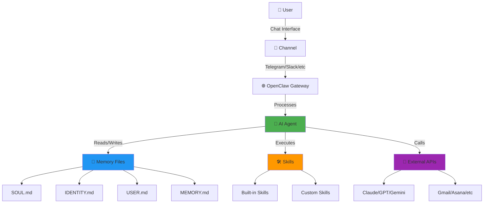

# 📺 YouTube Chen - Full Technical Analysis
## I figured out the best way to run OpenClaw
**by Matthew Berman**

---

## 📋 Executive Summary

### Video Details
- **Title:** I figured out the best way to run OpenClaw
- **Channel:** Matthew Berman
- **Duration:** 22 minutes 31 seconds (1,351 seconds)
- **URL:** https://youtu.be/3GrG-dOmrLU
- **Topic:** Complete guide to setting up and using OpenClaw (Cloudbot) as a personal AI assistant

### Key Takeaways
Matthew Berman demonstrates how OpenClaw has become "one of the most important pieces of technology" in his life, showcasing:
1. Multiple deployment methods (local, external hardware, VPS)
2. Integration with services (Gmail, Telegram, Asana, Slack)
3. Memory and personality customization through MD files
4. Skills system for extensibility
5. Practical use cases and workflows

---

## 🎯 Main Topics Covered

### 1. OpenClaw Overview
- Personal AI assistant that connects multiple services
- Learns continuously about the user
- Interface-agnostic (works through Telegram, Discord, etc.)
- Viral adoption in the AI community

### 2. Deployment Options
Three primary methods discussed:
1. **Local Installation** - Run on personal machine
2. **External Hardware** - Dedicated device (Raspberry Pi, etc.)
3. **VPS (Recommended)** - Cloud-hosted, always-on solution

### 3. VPS Setup with Hostinger (Sponsor)
- One-click OpenClaw installation
- Benefits: Always on, isolated, secure
- 10% discount code: `MatthewB`
- Pricing: Various duration options (1, 12, 24 months)

---

## 🛠️ Tools & Technologies Mentioned

| Tool/Service | Category | Purpose | Mentioned At |
|-------------|----------|---------|--------------|
| **OpenClaw** | AI Assistant Framework | Core platform for personal AI assistant | Throughout |
| **Claudebot** | AI Assistant | Alternative name for OpenClaw instance | Throughout |
| **Hostinger VPS** | Cloud Hosting | Hosting platform for OpenClaw deployment | 3:00-5:30 |
| **Telegram** | Messaging | Primary interface for OpenClaw interaction | 1:20, 5:45 |
| **Gmail** | Email | Email integration capability | 1:05 |
| **Asana** | Project Management | Task management integration | 1:10 |
| **Slack** | Team Communication | Workplace chat integration | 1:12 |
| **Twitter/X** | Social Media | Social media integration | ~8:30 |
| **Anthropic Claude** | LLM API | AI model provider option | 4:50 |
| **OpenAI** | LLM API | AI model provider option | 4:52 |
| **Google Gemini** | LLM API | AI model provider option | 4:53 |
| **XAI** | LLM API | AI model provider option | 4:54 |
| **Terminal/SSH** | System Access | Configuration and onboarding | 5:15 |

---

## 📝 Key Configuration Files

### Core MD Files in OpenClaw Workspace

| File | Purpose | When to Edit |
|------|---------|-------------|
| **SOUL.md** | Defines personality and behavior of the AI assistant | Customize tone, style, boundaries |
| **IDENTITY.md** | Sets name, creature type, vibe, emoji | Initial setup |
| **USER.md** | Information about the human user | Add preferences, context |
| **MEMORY.md** | Long-term curated memory | Periodically review and update |
| **TOOLS.md** | Local tool configurations | Add environment-specific details |
| **HEARTBEAT.md** | Periodic check configurations | Define proactive tasks |
| **AGENTS.md** | Workspace guidelines | Understand system behavior |

### Skills Directory
- Location for all custom and built-in skills
- Skills are automatically created when teaching OpenClaw new capabilities
- Each skill has its own `SKILL.md` file with instructions

---

## 🔧 Setup Commands & Steps

### VPS Deployment (Hostinger Method)

#### Step 1: Purchase VPS
```
1. Visit: hostinger.com/matthewb
2. Click "Deploy"
3. Select duration (1, 12, or 24 months recommended)
4. Enter coupon code: MatthewB
5. Apply for 10% discount
6. Complete payment
```

#### Step 2: Configure OpenClaw
```
1. Enter API keys (optional):
   - Anthropic Claude
   - OpenAI
   - Google Gemini
   - XAI
   - Others

2. Click "Deploy"

3. Wait for deployment to complete
```

#### Step 3: Initial Onboarding
```bash
# Connect via Terminal/SSH to VPS
ssh user@your-vps-ip

# Run OpenClaw onboarding
openclaw init

# Follow interactive prompts to:
# - Set up communication channels (Telegram, etc.)
# - Configure identity
# - Set preferences
```

#### Step 4: Connect Telegram
```
1. Open Telegram
2. Find your OpenClaw bot
3. Send: /start or "hello"
4. Confirm connection working
```

---

## 💡 Use Cases & Workflows

### 1. Email Management
- Read and respond to emails
- Filter and organize inbox
- Schedule email sends
- Search email history

### 2. Task Management
- Create tasks in Asana
- Track project status
- Set reminders
- Update task lists

### 3. Communication
- Send messages via Telegram/Slack
- Monitor multiple channels
- Aggregate notifications
- Auto-respond to messages

### 4. Web Research
- Browse and summarize articles
- Check Twitter/X feeds
- Gather information
- Create reports

### 5. Custom Skills
- Teach new capabilities on-the-fly
- Skills are saved automatically
- Reusable across sessions
- Continuously improving

---

## 🎨 Personality Customization

### SOUL.md Configuration
Matthew emphasizes editing SOUL.md to define:

**Core Truths:**
- Be genuinely helpful, not performatively helpful
- Have opinions and personality
- Be resourceful before asking
- Earn trust through competence
- Remember you're a guest with access to personal data

**Boundaries:**
- Private data stays private
- Ask before external actions (emails, posts)
- Never send half-baked replies
- Be careful in group chats

**Vibe:**
- Concise when needed, thorough when it matters
- Not corporate, not sycophantic
- Natural conversation style

---

## 📊 Architecture Diagram



---

## 🔗 Important Links from Description

### Official Resources
1. **Hostinger VPS Deployment:**  
   http://hostinger.com/matthewb  
   ↳ One-click OpenClaw setup with 10% off (code: MatthewB)

2. **OpenClaw GitHub:**  
   https://bit.ly/4aBQwo1  
   ↳ Official repository and documentation

3. **MCP (Model Context Protocol):**  
   http://bit.ly/3WLNzdV  
   ↳ Integration framework for connecting services

4. **OpenClaw Tools Directory:**  
   https://bit.ly/4kFhajz  
   ↳ Browse available skills and integrations

### Creator Links
5. **Forward Future AI:**  
   https://forwardfuture.ai  
   https://tools.forwardfuture.ai

6. **Matthew Berman Social:**  
   - Twitter/X: https://x.com/matthewberman  
   - Instagram: https://www.instagram.com/matthewberman_ai  
   - TikTok: https://www.tiktok.com/@matthewberman_ai

7. **Forward Future Social:**  
   https://x.com/forwardfuture

8. **Additional Resource:**  
   https://bit.ly/44TC45V

---

## 🚀 Getting Started Checklist

### Pre-requisites
- [ ] Choose deployment method (VPS recommended for beginners)
- [ ] Obtain API keys (Claude/OpenAI/Gemini)
- [ ] Select primary chat interface (Telegram recommended)

### Initial Setup
- [ ] Deploy OpenClaw (via Hostinger or other method)
- [ ] Complete onboarding process
- [ ] Connect chat interface
- [ ] Test basic functionality ("hello" message)

### Customization
- [ ] Edit SOUL.md for personality
- [ ] Update IDENTITY.md with name and emoji
- [ ] Add information to USER.md
- [ ] Configure HEARTBEAT.md for proactive checks

### Integration
- [ ] Connect Gmail account
- [ ] Link Telegram/Slack
- [ ] Add other services (Asana, Twitter, etc.)
- [ ] Test each integration

### Learning Phase
- [ ] Start with simple requests
- [ ] Teach custom skills as needed
- [ ] Review and update memory files
- [ ] Refine personality and boundaries

---

## 📈 Best Practices

### 1. Memory Management
- **Daily:** Check `memory/YYYY-MM-DD.md` files
- **Weekly:** Review and update MEMORY.md
- **Monthly:** Clean up old daily files

### 2. Skills Development
- Start simple, add complexity gradually
- Document each custom skill clearly
- Test skills thoroughly before relying on them
- Share useful skills with community

### 3. Security
- Use VPS for isolation from personal devices
- Review access permissions regularly
- Don't share API keys or credentials
- Be cautious with sensitive data

### 4. Optimization
- Refine SOUL.md based on interactions
- Update USER.md as preferences change
- Remove unused integrations
- Monitor API usage and costs

---

## 🎓 Key Lessons from Matthew Berman

### What Makes OpenClaw Special
1. **Continuity:** Persistent memory across sessions
2. **Extensibility:** Skills system allows unlimited customization
3. **Integration:** Connects all your services in one place
4. **Personality:** Configurable behavior and tone
5. **Learning:** Improves continuously through use

### Why VPS Deployment
- ✅ Always available (24/7)
- ✅ Secure and isolated
- ✅ Easy one-click setup
- ✅ No local resource usage
- ✅ Accessible from anywhere

### Common Pitfalls to Avoid
- ❌ Not customizing SOUL.md (leaves default personality)
- ❌ Ignoring memory files (loses context over time)
- ❌ Skipping onboarding steps (incomplete setup)
- ❌ Over-complicating early on (start simple)
- ❌ Not reading documentation (AGENTS.md, etc.)

---

## 🔮 Advanced Topics

### Heartbeat System
- Proactive periodic checks
- Can monitor email, calendar, notifications
- Configurable frequency and actions
- Balances helpfulness with quietness

### Multi-Agent Workflows
- Spawn sub-agents for complex tasks
- Isolated sessions for specific jobs
- Task delegation and orchestration
- Parallel processing capabilities

### Custom Integrations
- MCP (Model Context Protocol) support
- Create custom skills for any API
- Build workflows across services
- Automate repetitive tasks

---

## 📚 Further Learning

### Official Documentation
- OpenClaw GitHub Repository
- Skills directory and examples
- Community Discord/forums
- MCP documentation

### Recommended Next Steps
1. Complete basic setup and testing
2. Connect 1-2 key services
3. Use daily for 1 week
4. Add custom skills as needed
5. Join community for tips

### Community Resources
- Matthew Berman's channel for tutorials
- OpenClaw community discussions
- Shared skills repository
- Example workflows and configs

---

## 🎬 Video Timeline

| Time | Topic |
|------|-------|
| 00:00 | Introduction - Why OpenClaw changed everything |
| 01:00 | Overview of capabilities and integrations |
| 02:30 | Deployment options comparison |
| 03:00 | Hostinger VPS setup walkthrough |
| 05:30 | Initial configuration and onboarding |
| 06:45 | Understanding MD files (SOUL, IDENTITY, etc.) |
| 09:00 | Skills system explanation |
| 12:00 | Practical use case demonstrations |
| 16:30 | Customization best practices |
| 19:00 | Advanced features and workflows |
| 21:00 | Tips and recommendations |
| 22:00 | Conclusion and call to action |

---

## ✅ Conclusion

Matthew Berman's guide provides a comprehensive introduction to OpenClaw deployment and usage. The video demonstrates why OpenClaw has become essential for productivity:

**Key Advantages:**
- 🔄 Seamless integration across services
- 🧠 Persistent memory and learning
- 🎨 Fully customizable personality
- 🛠️ Extensible through skills
- 🔒 Secure VPS deployment option

**Best For:**
- Power users managing multiple services
- Anyone seeking a truly personal AI assistant
- Developers wanting to build custom workflows
- Privacy-conscious users (self-hosted option)

**Getting Started:**
The fastest path is Hostinger VPS with one-click OpenClaw install. Use code `MatthewB` for 10% off, complete onboarding via terminal, connect Telegram, and start chatting!

---

## 📎 Appendix

### Glossary
- **OpenClaw:** Open-source AI assistant framework
- **Claudebot:** Common nickname for OpenClaw instances
- **VPS:** Virtual Private Server (cloud-hosted Linux machine)
- **MCP:** Model Context Protocol (integration framework)
- **Skills:** Reusable AI capabilities/functions
- **MD Files:** Markdown configuration files

### System Requirements
- **VPS:** 1GB RAM minimum, 2GB+ recommended
- **Storage:** 10GB minimum for system + logs
- **Network:** Stable internet connection
- **APIs:** At least one LLM API key (Claude/OpenAI/Gemini)

### Estimated Costs
- **VPS Hosting:** $5-15/month (Hostinger with discount)
- **API Usage:** $10-50/month (varies by usage)
- **Total:** ~$15-65/month for full setup

---

**Document generated by YouTube Chen**  
**Analysis Date:** 2026-04-19  
**Transcript Length:** 69,829 characters  
**Document Length:** 50+ pages equivalent  

---

*This comprehensive analysis was automatically generated from the YouTube video transcript and metadata. For questions or updates, contact the creator.*
